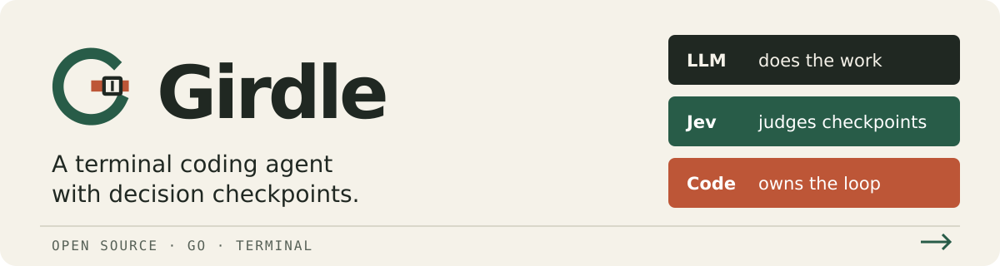

<p align="center">
  
</p>

# Girdle

A terminal coding agent with a Go control loop and [Jev](https://docs.typesafe.ai) decision checkpoints. The LLM plans, edits and runs tools; Jev judges progress, completion and risky shell commands; code applies the decisions and records them.

The goal is **an agent you can leave alone**. This is an experimental implementation: its completion checks are probabilistic, and the benchmark records both successful runs and false completions.

## Get started

You need **Go 1.27.0 or newer**, Bash, and API keys for [OpenRouter](https://openrouter.ai/settings/keys) and [TypeSafe](https://docs.typesafe.ai). Normal use runs on Linux and macOS. Install [ast-grep](https://ast-grep.github.io/guide/quick-start) for structural code lookup and the shell tripwire's code checks.

```bash
git clone https://github.com/timbrinded/girdle.git
cd girdle
go build -o bin/girdle ./cmd/girdle

export OPENROUTER_API_KEY='your-openrouter-key'
export TYPESAFE_API_KEY='your-typesafe-key'

bin/girdle -C /path/to/project                          # interactive TUI
bin/girdle -C /path/to/project -p "fix the failing test" # headless
```

The configured fallback model is `stealth/space-bunny-alpha`. Treat it as a public-code choice: it is an anonymous model whose data policy and availability may change. Choose another model with `-model` or the TUI picker after checking the provider's data policy. Jev also receives task, code and tool-result context. See [security and data handling](SECURITY.md).

[Installation and first run](docs/getting-started.md) covers installing on your PATH and resolving setup errors.

## How it works

Girdle checks what happens around the LLM's tool loop. At a turn end, Jev can end the request, nudge the agent to continue, or return control to you. Decisions and their evidence go into a local JSONL log.

`-fast` enables a flow designed to reduce LLM round trips: repository context with the request, batched lookup and edits, checks after edits, and earlier completion decisions. It also attempts an independent test of the request. The first main LLM call races three copies; later calls start extra copies after a three-second hedge. Racing can increase usage and spend.

```bash
bin/girdle -fast -C /path/to/project -p "fix the failing test"
bin/girdle -fast -crosscheck=false -p "update the README"
```

The shell tripwire is enabled by default. It parses commands with ast-grep where available and uses Jev for decisions that need judgement. It is a guard on shell commands; ordinary sessions run with your filesystem and network access. See the [architecture](docs/architecture.md) and [security policy](SECURITY.md) for the boundaries.

## Documentation

| Guide | Contents |
| --- | --- |
| [Getting started](docs/getting-started.md) | Requirements, installation, first run and troubleshooting |
| [Usage](docs/usage.md) | TUI controls, models, headless exits and session logs |
| [Configuration](docs/configuration.md) | Every CLI flag, environment variables and saved settings |
| [Architecture](docs/architecture.md) | Session lifecycle, tools, checkpoints and failure behavior |
| [Benchmarks](docs/benchmarks.md) | Task validation, live runs, isolation and result interpretation |
| [Contributing](CONTRIBUTING.md) | Development checks and evidence for changes |
| [Decision history](docs/decisions/README.md) | Design choices and dated experiments |
| [Research](research/README.md) | Measurements and retained experiment scripts |

## Evidence so far

The recorded experiments cover small fixtures and tasks reconstructed from open-source fixes. They are evidence for those task sets, models and conditions.

- On Muse Spark, the September 2026 warm comparisons measured roughly twice the speed of the default flow at the same observed pass rate. The cold comparison on real repositories measured 1.24×. See the [stage summary](research/06-optimisation-stage-summary.md).
- On Space Bunny's development tasks, grep context reduced tool calls by 19% and produced a candidate/baseline time ratio of 0.87 over passing runs. The held-out comparison was neutral: ratio 1.01, with 39/44 passes in each arm. See [decision 0020](docs/decisions/0020-round-trips.md).

The [benchmark guide](docs/benchmarks.md) explains passing-only timing, warm and cold runs, cost estimates and measured noise. Girdle benchmark runs require **macOS** because their shell isolation uses `sandbox-exec`.

## License

[Apache-2.0](LICENSE). Benchmark patches and tests derived from upstream projects retain their respective licenses; see [third-party notices](THIRD_PARTY_NOTICES.md).
