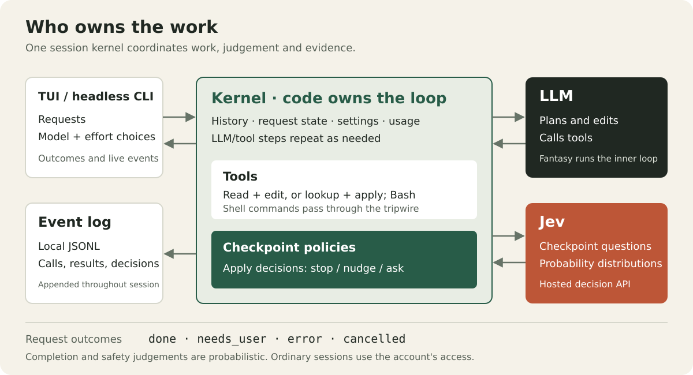

# Architecture

Girdle separates three responsibilities: the LLM produces work, Jev judges meaning, and the Go kernel owns execution and session state. The current routing mechanism chooses reasoning effort for the selected model; automatic selection of a cheaper model per step remains a project goal.

## Ownership

| Package | Responsibility |
| --- | --- |
| [cmd/girdle](../cmd/girdle/main.go) | Parse flags, construct providers, load saved defaults, choose TUI or headless output |
| [internal/kernel](../internal/kernel/) | Own history, request state, tool execution, checkpoints, halts and usage |
| [internal/checkpoint](../internal/checkpoint/) | Define questions, evidence, probability thresholds and decision policies |
| [internal/jev](../internal/jev/jev.go) | Authenticate and call Jev's System One API with retries |
| [internal/tools](../internal/tools/) | Read and change files, run Bash, look up code, apply batches and collect command facts |
| [internal/race](../internal/race/race.go) | Race or hedge main LLM calls and report estimated losing-copy usage |
| [internal/models](../internal/models/) | Persist model choices and read OpenRouter catalogue facts |
| [internal/tui](../internal/tui/) | Display events and collect requests, model choices and effort settings |
| [internal/clip](../internal/clip/clip.go) | Bound displayed and checkpoint text while preserving valid UTF-8 |

[Fantasy](https://github.com/charmbracelet/fantasy) owns the inner LLM/tool loop. Bubble Tea, Bubbles and Lip Gloss provide the terminal UI. The dependency versions are in [go.mod](../go.mod).

## Request lifecycle

1. **Start.** A session resolves feature dependencies once. Each request applies queued model/effort settings, clears request-local facts and records the user's message. History carries over between requests in the TUI.
2. **Prepare context.** With snapshot enabled, the request includes repository text within a budget. Larger repositories include a file list, agent instructions and code named in the request; prefetch can add files judged relevant by Jev.
3. **Route effort.** Jev judges request complexity and whether it asks for tests. With auto effort, the answer chooses reasoning effort. Pinned effort still permits background request classification. Speculation starts a guessed-effort call but holds its answer until routing is known; a different routed effort causes a restart before tools run.
4. **Execute.** Fantasy streams the LLM's answer and dispatches tool calls. The kernel records calls/results, changed paths, checks, usage and timing. The tripwire runs before shell execution.
5. **Evaluate progress.** Enabled heartbeat and early-stop checkpoints can nudge or halt. After a successful check, fast flow attempts its generated cross-check and checks requested removals before deciding completion. A generated cross-check can be absent, invalid or not ready; its event records that outcome.
6. **End or continue.** At an ordinary turn end, the completion checkpoint selects `stop`, `nudge` or `ask`. A nudge adds a user message to history and starts another turn. The request ends as `done`, `needs_user`, `error` or `cancelled`, and a `run_end` event records why.

The main turn-end policy considers the reported status, evidence and requirement coverage. It is a probabilistic assessment of the supplied context. Hidden-test failures and false completions in the [benchmark history](benchmarks.md#recorded-results) show why it is not a correctness guarantee.

## Tools and checks

The default tools are `read`, `write`, `edit` and `bash`. Batch mode uses `lookup` and `apply` alongside `bash`. Lookup gathers several files, definitions or searches in one call; apply makes a set of changes and then runs the supplied check.

Apply is **not atomic**: an error can leave earlier changes applied, and the check does not run if applying the changes fails. A later request can inspect and fix that state. With reproduction enabled, apply can temporarily undo the fix to run its regression test. A failed command is called a reproduction only when Jev judges that the test actually ran and failed.

Search context can attach the containing definitions to matches. Snapshot, lookup and prefetch reduce reading round trips; batched edits reduce writing round trips. Racing is separate: it sends extra copies of main calls, trading compute for latency.

## Checkpoints and failures

Checkpoint question maps and policies are Go data. All questions for one checkpoint share a Jev request, and their returned probabilities inform the policy. The common call wrapper records answers, model, latency, token usage and errors. A missing answer makes the call fail rather than becoming a zero-probability judgement.

| Failure or limit | Result |
| --- | --- |
| Turn-end Jev request fails | Return `needs_user` with `jev_unavailable` |
| Effort route fails | Use the configured fallback effort |
| Tripwire needs judgement but Jev is unavailable | Refuse the command and return control to the user |
| Early-stop judgement cannot establish completion | Continue to the ordinary loop and turn-end decision |
| Cross-check cannot supply a valid ready test | Record its outcome; it supplies no independent passing-test evidence |
| LLM provider call fails | Emit an error and end the request, or cancellation if its context ended |
| Log write fails | Report an event-log error through the UI/output callback |
| Cancellation or headless deadline | Cancel the request; active shell process groups are killed |

Feature prerequisites live in [Config.resolved](../internal/kernel/config.go). A typed halt coordinates completion, nudges and user handoff; a blocked shell command takes precedence over a nudge. See [decision 0022](decisions/0022-kernel-structure.md) for that restructuring.

## Access and persistence

The shell tripwire combines parsed facts, a code floor and Jev judgement. Without ast-grep's parse, every shell command goes to Jev. This is not an OS sandbox, and direct file tools can accept absolute paths. The optional macOS restrictions constrain shell network/read access for benchmarks. [Security](../SECURITY.md) describes the exact boundaries and provider data flow.

The kernel serializes events into an append-only JSONL file. The TUI receives streamed text too, but text deltas are omitted from persistent logs. Saved model choices and the cached catalogue live separately under XDG config/cache directories. The [usage guide](usage.md#session-logs) describes the events and locations.

Historical choices, removed experiments and measurements are indexed in [decisions](decisions/README.md) and [research](../research/README.md).
